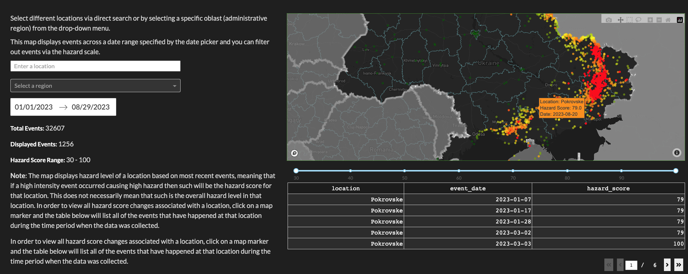

 
### Project Overview 

---  

The aim of this project was to provide a hazard score for all locations in Ukraine that were involved in war-related events such battles, explosions/remote violence events, violence against civilians and factors that pose risk to civilians living in those locations. The idea is to take those factors and condense them into one readable and comprehensible score which would reflect the danger level of the associated location.  
  
The main issue I have faced while developing a statistical method that could provide such a score was to combine domain knowledge and account for the known unknowns. In complex events like wars, it's very difficult to obtain a comprehensive dataset that can capture the underlying dynamics. Not because of lack of data but due to the abundance and sheer number of factors involved that are either too hard or too expensive to account for. Furthermore, the issue of inherent bias involved in various sources is also prevalent and poses a serious risk of polluting a dataset. Hence, besides accounting for all factors that contribute to an event, one must also consider how valid the data that they’re using is. Therefore, I decided to use the data provided to me by the [Armed Conflict Location & Event Data Project](https://acleddata.com/) (ACLED) for non-commercial purposes, the aim of this project is for data exploration, visualization and awareness. ACLED is a non-profit organization that has been collecting data on armed conflict events since 2014. For further information on ACLED please refer to the hyperlink above.  
  
ACLED’s raw dataset was comprehensive enough to include three levels of administrative borders for each location, event types, sub events, dates, casualties, presence of civilian targeting, what actors were involved in the event, and a text based note column that included additional information pertaining to the event. As mentioned before, due the complexity and nature of armed conflicts there are a significant number of factors that cannot be accounted for and some are just not available to the public. Namely for this project, ideally, I would need access to air defense numbers in a location, overall equipment concentration, the number of missiles that have been launched in a remote violence event, where they were launched from, how many have been shot down, logistic routes and hubs and this is just to name a few. Some of this data is available to the public, but the sources are sparse and inconsistent. In other words, the known unknowns. Hence, for now I have decided to use the baseline data set from ACLED and process the data enough to account for some of those factors I mentioned earlier.  
  
In later updates to this project, I aim to include some new features such as whether a location is part of a logistic route, missile count and type and reduce the number of hardcoded points that are used to account for domain knowledge on the war in Ukraine. Furthermore, for people interested in numbers, I will also include various plots to show event distributions, frequencies and more visualizations of various relationships that are present in the dataset. Nevertheless, I am happy with how this project has turned out and its accuracy in reflecting the danger level of locations across Ukraine.  
  
> Note on the project's implementation: everything was done using python and various data processing libraries, numpy and pandas being at the core of it and plotly’s dash was used for making the web app. 


Quick glance at the main dashboard:


  
### Methodology

---

1. ##### Data Acquisition
    First, in order to obtain the raw dataset I had to write a python script that uses ACLED’s API and a list of query filters that will filter out any data that I find irrelevant for this project or the dataset batch I am working on. I made different batches of data since the events in Ukraine would also develop in separate phases. For example, UAF’s (Ukrainian Armed Forces) summer offensive in 2022 which lead to the reclamation of a significant portion of the Kharkiv region presents a different state of events than what happened during the winter of 2023 with Russia’s winter offensive and the battle for Bakmut involving Wagner pmc’s. Furthermore, some data like iso (country code of the event), event id, and a few other id columns were filtered out from the dataset due to their irrelevance for the task at hand alongside with source type (source of the event report), source scale, and inter 1 and inter2. The reason for dropping some of the non-id related columns was due to them not contributing to the actual relationships between the data I was exploring and some features that were included already carry the context of those dropped features. 

    The obtained filtered dataset includes the following baseline features (i.e columns): event date, event type (Battles, Explosions/Remote violence, Violence against civilians), sub event type (armed clashes, shelling/artillery/missile attack, etc.), actor1, actor2, admin1, admin2, admin3 (the 3 admin columns are representing 3 levels of administrative boundaries of the location), location, latitude, longitude, notes (short description of the event), fatalities, civilian targeting (whether civilians were the primary target or not).

2. ##### Data Preprocessing 
    As my first step in data preprocessing I have read the json dataset and converted it into a dataframe using pandas (think of it like an excel sheet). I have then explored the datatypes of all columns and converted fatalities, latitude and longitude to numeric type. Then after exploring the dataset, I noticed that the notes column would sometimes include data on casualties. This was an important finding since I knew that some events actually had a significant number of civilian casualties that weren’t counting as fatalities and overall a significant number was never reported either, due to the lack of clarity in numbers varying between sources. Hence, even when some severe events like missile strikes or battles have occurred that had large numbers of casualties reported by external sources, the raw dataset would have 0 fatalities. In order to account best for casualties and affected parties, I have opted-in to try and extract this data from the text-based notes column. Due to varying formatting and wording something like regular expressions could not be used as a lot of the entries would get ignored due to formatting. Therefore, I have used SpaCy’s NLP machine learning model to do the trick. After setting the proper conditions for the token, the model was able to extract wounded data from the notes column and thus I created a new feature called ‘wounded’ which represents the number of wounded individuals involved in the event.

3. ##### Data Aggregation & Feature Engineering 
    Next step was to aggregate the data. As mentioned before, each row would have an event date and thus I thought it’s best to aggregate the data by month for a location to condense the data a bit. This led to the creation of 2 new aggregate features: number of events and total casualties.

    As mentioned before, there was a certain amount of domain knowledge that needed to be incorporated into the statistical approach designed for this project. Hence, I decided to create a coordinate list of locations that are well-known hotzones, such as Bakhmut, Kupiansk, Avdiivka, Vuhledar, Robotyne, and Soledar. The reasoning behind this is to use it as a reference point for a location's proximity to the battlefront. Those locations and a lot of others that neighbor them are known engagement zones which would have a hazard score of 100. In order to obtain the distance between a location and a hot zone I have used the haversine function which measures the distance between two sets of coordinates while accounting for earth’s curvature. After obtaining the distances of a location to each of the hot zones, I have selected the shortest distance out of all of them and created a new feature called minimal distance to the battlefront.

    Now that new features have been added, the next step was to encode some categorical features like event type and civilian targeting into numerical values using one-hot encoding. This way it's easier for the model to read the features as it can check whether a specific type of event has occurred simply by setting 1 or 0 in the respective column. Furthermore, I combined explosions/remote violence events with civilian targeting to differentiate between missile strikes on civilian infrastructure and shelling events at the frontline. The idea is that if civilian targeting has a true value in the same row where the explosion event is also registered then that means it's most likely a remote violence event caused by missile strikes on civilian infrastructure away from the frontline. The logic behind this is that it will be very unlikely that you will have a registered explosion event involving civilians at the front lines and thus any explosion/remote violence event that has false value for the civilian targeting column most likely points to an artillery event at the front lines, in other words, a high hazard zone. This was later confirmed by artillery sub event type in rows that have that event type and false for civilian targeting.

4. ##### Feature Processing with t-SNE & KDE 
    Since I don’t have a ground truth feature, like a hazard score for each location, there was no way to use a supervised model to learn the right patterns and relationship in the data, unless I would synthesize a pool of hazard scores to train the model on. Instead, I opted for an unsupervised approach:

    - **t-SNE Embedding**: I used t-SNE (t-distributed stochastic neighbor embeddings) to produce 2-D embeddings based on encoded event types, number of events, and total casualties. The aim was to reduce the data's dimensionality while preserving inherent relationships, given the multiple features I had.

        > **Note on t-SNE**: The high nonlinearity of t-SNE and potential loss of global relationships mean the resulting coordinates are not directly interpretable in terms of the original features.
    
    - **Kernel Density Estimation**: I applied Gaussian kernel density estimation (KDE) to the t-SNE results. KDE estimates the probability density function of the data, letting us identify dense clusters in the 2-D space.

    - **Densest Point**: After computing the density using KDE, I identified the densest point, which represents the most prominent pattern in the data.

    - **Distance Calculation**: A new column was added to hold the distance of each data point to the densest point.

    - **Distance Scoring**: Finally, I converted the raw distance values to a distance score, applying exponential decay. This ensures that data points closer to the densest point are weighted differently than those further away, emphasizing their significance.

5. ##### Proximity to Battlefront Distance Scoring
    While the t-SNE-derived distance scores effectively condensed several features, I believed they weren't sufficient by themselves to gauge the hazard level of a location. I intentionally left out a critical domain knowledge-based feature: the minimal distance to the battlefront. The proximity to the frontline is a defining parameter for the hazard score; locations closer to the front are inherently more dangerous.

    To integrate this feature effectively:

    - **Distance Conversion**: I transformed the proximity to the battlefront into a score using exponential decay. The idea is simple: as the distance from the frontline increases, the associated score decreases exponentially.

    - **Rationale**: This captures the reality that while the frontline might stretch across vast areas, its most hazardous regions are concentrated in clusters. Therefore, locations even just ~100km away experience a significant reduction in danger compared to those nearby.

    - **Heuristic Approach**: It's worth noting that this approach is heuristic. Determining the exact decay factor required experimentation to ensure a realistic representation of the distance's influence on the hazard level.

6. ##### Hazard Score Computation
    Finally, this brings us to the calculation of the hazard scores. I have chosen a weighted sum approach to combine both t-SNE derived distance points and the physical proximity distance score from the previous step. The reasoning behind this is that by using heuristically derived weights I was able to apply my own knowledge to decide on the level of significance of how much each value contributes to the final score. The final split was to allocate a weight of 0.7 for distance and 0.3 for the features processed with t-SNE and KDE. The t-sne features are more there to account for auxiliary factors and the known unknowns, however, we know for a fact that all the features associated with highest danger that are not present in this data set (aside from events types) are all present at the front and locations closest to it. Which is why distance gets the dominant weight in the hazard scores computation.

    Further additional steps were taken to incorporate domain knowledge. Those being: setting locations that are within 30 km to the battlefront with a score of 100; setting the minimum score for all locations at 30; locations with battles automatically get a score of 100. The reasoning behind a score for 30 as a minimum is that many Ukrainian villages, towns and cities get shelled and subjected to remote violence events almost every day, either due to being a logistic hub, a command center, probing for air defense or simply for pure terror to exhaust civilians and breakdown morale in the population. The presence of air defense mitigates a lot of the risk and it has been getting relatively safer, but the frequency of attacks hasn’t been reducing and the opponent is coming up with new tactics too. Furthermore, even if a target gets taken down, casualties still happen due to debris and other collateral effects. As for the 30km distance and battle events hardset point allocation, this decision is because those locations are practically at the front lines or are the frontlines themselves.

7. ##### Hazard Score Propagation 
    After analyzing the obtained scores, doing domain-based validation and visualizing the data, I have noticed that a significant amount of locations that are neighbouring the frontlines or are in occupied territory, show low hazard scores. To solve this issue I had an idea to develop a method that will propagate a percentage of a neighboring hot zone (80+ hazard score) to locations within its 80 km radius. However, only locations with a hazard score below 80 would be selected for inheritance. This way we avoid applying this effect on already highly hazardous locations that are used as hazard sources, as well as conserving computational resources.

    The amount that each location within that radius inherits is determined by how far it is from its nearest hot zone. In order to obtain a list of hot zones and neighboring locations, I have used pandas to create 2 DataFrames to separate locations with an 80+ hazard score from the rest and then I cross-joined in order to obtain all possible location combinations, where the pairings will be later used for distance calculation.
    ```python
    hazard_hi = df[df["hazard_score"] >= 80][
        ["event_date", "admin3", "location", "latitude", "longitude", "hazard_score"]
    ]
    hazard_lo = df[df["hazard_score"] < 75][
        ["event_date", "admin3", "location", "latitude", "longitude", "hazard_score"]
    ]
    cross_lo_hi = hazard_lo.merge(hazard_hi, how="cross", suffixes=("_low", "_high"))
    ```
    > As you may have noticed, I also filter out locations with a hazard score of larger than 75 from the non-hot zones. The reasoning behind is that those locations are usually pretty hot themselves but not hot enough to propagate hazard. Those locations are usually subjected to some shelling events and exposed to pre-front collateral effects, but they themselves are unlikely to spread hazard as they usually aren't battlezones. Hence, they are excluded from both location pools. 

    Then I proceeded to drop duplicate entries, location-wise, since the current dataset has monthly entries per location which led to the creation of many location pair duplicates. Now, with a set of all possible location combinations I have applied the previously used haversine function, leveraging numpy to take full advantage of vectorization (i.e multithreading). After obtaining the distances, I have filtered out all locations that are farther than 80km from a hot zone. This way we can ensure that we’re not propagating hazard scores to remote locations, but only to those within the effective range of a hot zone. At this stage, many locations had multiple entries due to being close to multiple hot zones at once. In order to find the closest hot zone for each location I had used the groupby and idxmin methods to find the indexes of pairings with shortest distance to one another:
    ```python
    min_distance_idx = cross_lo_hi.groupby("location_low")["distance"].idxmin()
    cross_lo_hi = cross_lo_hi.loc[min_distance_idx].reset_index(drop=True)
    ```
    After applying the index mask, we have effectively obtained the shortest distance to a hot zone and its hazard score for each location. All that was left prior to propagating the hazard scores was to merge the newly obtained filtered DataFrame with the original one using a left join and fill in some missing values, since not all locations were selected for propagation. 
    ```python
    df = df.merge(
        cross_lo_hi[["location_low", "distance", "hazard_score_high"]],
        left_on="location",
        right_on="location_low",
        how="left",
    )

    df.drop(columns="location_low", inplace=True)

    df["distance"].fillna(0, inplace=True)
    df["hazard_score_high"].fillna(0, inplace=True)
    ```
    Finally, in order to compute the inherited hazard score I applied exponential decay to 80% of the hazard score from the location that is spreading its hazard score. Here’s a code snippet of the decayed propagation:
    ```python
        df["hazard_decayed"] = 0.6 * df["hazard_score_high"] * (1 - 0.02) ** df["distance"]
        df["hazard_score"] += df["hazard_decayed"]
    ```
    As a result after this hazard score propagation effect, we have now obtained more realistic hazard scores in near front locations. 

    > For further details on the implementation, please refere to the **hazard_script.py** file, located in the main directory. 
8. ##### Validation 
    After visualizing the obtained data I was left satisfied with the outcome considering my domain knowledge. Further assessments by Ukrainians and people with domain knowledge have confirmed that the visualization demonstrates a clear and accurate outlook on the hazard level of locations across Ukraine.After visualizing the obtained data I was left satisfied with the outcome considering my domain knowledge. Further assessments by Ukrainians and people with domain knowledge have confirmed that the visualization demonstrates a clear and accurate outlook on the hazard level of locations across Ukraine.

    
    ##### Author: Yegor Smertenko
